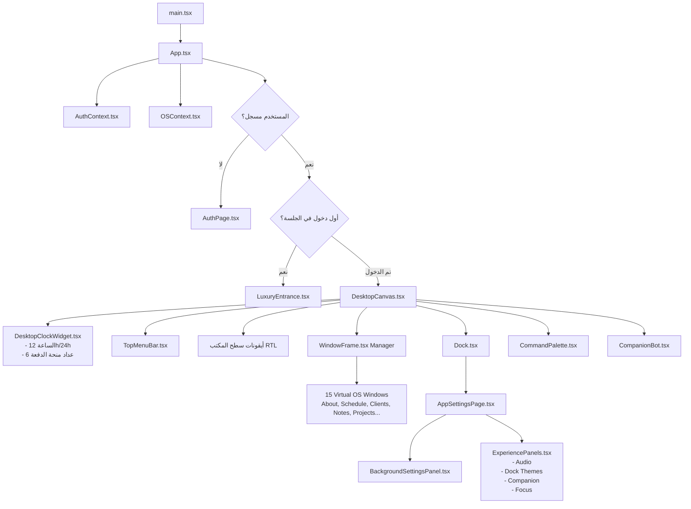

# 🗺️ Almdrasa Gateway — Project Map & Fast Navigation Index

> **دليل الخريطة الشاملة والتنقل الفائق في مشروع منصة بوابة المدرسة (Almdrasa Gateway / AuraOS)**
> Use this document to instantly locate, navigate, and understand any file, component, or system module in the codebase.

---

## ⚡ Quick-Jump Table (أين أجد...؟)

| المهمة أو الميزة المطلوب تعديلها | الملف الأساسي | المسار السريع |
|---|---|---|
| **سطح المكتب والشبكة والخلفيات** | `DesktopCanvas.tsx` | [DesktopCanvas.tsx](file:///c:/Users/pc/Desktop/Almdrasa%20Gateway/src/components/os/DesktopCanvas.tsx) |
| **الساعة العلوية وعداد منحة الدفعة 6** | `DesktopClockWidget.tsx` | [DesktopClockWidget.tsx](file:///c:/Users/pc/Desktop/Almdrasa%20Gateway/src/components/os/DesktopClockWidget.tsx) |
| **شريط التطبيقات السفلي (Dock)** | `Dock.tsx` | [Dock.tsx](file:///c:/Users/pc/Desktop/Almdrasa%20Gateway/src/components/os/Dock.tsx) |
| **ثيمات وتخصيص ألوان الـ Dock** | `dockThemes.ts` | [dockThemes.ts](file:///c:/Users/pc/Desktop/Almdrasa%20Gateway/src/data/dockThemes.ts) |
| **نوافذ التطبيقات وإطارات السحب/التحجيم** | `WindowFrame.tsx` | [WindowFrame.tsx](file:///c:/Users/pc/Desktop/Almdrasa%20Gateway/src/components/os/WindowFrame.tsx) |
| **لوحة الإعدادات العامة للنظام** | `AppSettingsPage.tsx` | [AppSettingsPage.tsx](file:///c:/Users/pc/Desktop/Almdrasa%20Gateway/src/components/os/settings/AppSettingsPage.tsx) |
| **إعدادات خلفية سطح المكتب وتدرجات الـ WebGL** | `BackgroundSettingsPanel.tsx` | [BackgroundSettingsPanel.tsx](file:///c:/Users/pc/Desktop/Almdrasa%20Gateway/src/components/os/settings/BackgroundSettingsPanel.tsx) |
| **إعدادات الصوت، المساعد، والتركيز** | `ExperiencePanels.tsx` | [ExperiencePanels.tsx](file:///c:/Users/pc/Desktop/Almdrasa%20Gateway/src/components/os/settings/ExperiencePanels.tsx) |
| **البحث السريع والتنقل (Cmd+K / Spotlight)** | `CommandPalette.tsx` | [CommandPalette.tsx](file:///c:/Users/pc/Desktop/Almdrasa%20Gateway/src/components/os/CommandPalette.tsx) |
| **المساعد المقيم (AI Companion Bot)** | `CompanionBot.tsx` | [CompanionBot.tsx](file:///c:/Users/pc/Desktop/Almdrasa%20Gateway/src/components/os/CompanionBot.tsx) |
| **شاشة الدخول السينمائية الفاخرة** | `LuxuryEntrance.tsx` | [LuxuryEntrance.tsx](file:///c:/Users/pc/Desktop/Almdrasa%20Gateway/src/components/os/LuxuryEntrance.tsx) |
| **تسجيل الدخول وبوابة الطلاب (Auth Portal)** | `AuthPage.tsx` | [AuthPage.tsx](file:///c:/Users/pc/Desktop/Almdrasa%20Gateway/src/components/auth/AuthPage.tsx) |
| **حالة النظام والنوافذ وإعدادات الذاكرة** | `OSContext.tsx` | [OSContext.tsx](file:///c:/Users/pc/Desktop/Almdrasa%20Gateway/src/context/OSContext.tsx) |
| **حالة الهوية والمصادقة والـ Supabase** | `AuthContext.tsx` | [AuthContext.tsx](file:///c:/Users/pc/Desktop/Almdrasa%20Gateway/src/context/AuthContext.tsx) |
| **أنواع البيانات ومخططات Zod للنظام** | `types/os.ts` | [types/os.ts](file:///c:/Users/pc/Desktop/Almdrasa%20Gateway/src/types/os.ts) |
| **محرك المؤثرات الصوتية (Web Audio Synth)** | `utils/audio.ts` | [utils/audio.ts](file:///c:/Users/pc/Desktop/Almdrasa%20Gateway/src/utils/audio.ts) |
| **الاختبارات الآلية وفحص التوافق** | `test/os.test.ts` | [test/os.test.ts](file:///c:/Users/pc/Desktop/Almdrasa%20Gateway/src/test/os.test.ts) |

---

## 🏗️ Architecture & Component Flow



---

## 📁 Source Tree Directory Map

### 1. Root Configuration & Entry
* [GEMINI.md](file:///c:/Users/pc/Desktop/Almdrasa%20Gateway/GEMINI.md) — Workspace rules, engineering standards, architecture constraints, and testing protocols.
* [index.html](file:///c:/Users/pc/Desktop/Almdrasa%20Gateway/index.html) — HTML5 Shell with Expo Arabic Font loading and SEO meta tags.
* [src/main.tsx](file:///c:/Users/pc/Desktop/Almdrasa%20Gateway/src/main.tsx) — React 19 root bootstrap wrapping `AuthProvider` and `OSProvider`.
* [src/App.tsx](file:///c:/Users/pc/Desktop/Almdrasa%20Gateway/src/App.tsx) — Main conductor orchestrating Auth, Luxury Entrance, WebGL Shader canvas, and OS desktop.
* [vite.config.ts](file:///c:/Users/pc/Desktop/Almdrasa%20Gateway/vite.config.ts) — Vite 8 build & dev server config with React plugin.
* [tailwind.config.js](file:///c:/Users/pc/Desktop/Almdrasa%20Gateway/tailwind.config.js) & [src/styles/index.css](file:///c:/Users/pc/Desktop/Almdrasa%20Gateway/src/styles/index.css) — Design tokens, custom scrollbars, gold gradients, fonts.

---

### 2. Core OS Components (`src/components/os/`)

| الملف | الوظيفة والمحتوى |
|---|---|
| [DesktopCanvas.tsx](file:///c:/Users/pc/Desktop/Almdrasa%20Gateway/src/components/os/DesktopCanvas.tsx) | الحاوية الأساسية لسطح المكتب: إدارة الأيقونات، الخلفية التفاعلية، وتوزيع النوافذ. |
| [DesktopClockWidget.tsx](file:///c:/Users/pc/Desktop/Almdrasa%20Gateway/src/components/os/DesktopClockWidget.tsx) | الكبسولة العلوية المزدوجة: الساعة الرقمية (12h/24h) + **عداد الأيام المتبقية لمنحة المدرسة (الدفعة 6)** مع بطاقة التقدم الزمني. |
| [Dock.tsx](file:///c:/Users/pc/Desktop/Almdrasa%20Gateway/src/components/os/Dock.tsx) | شريط الـ Dock التفاعلي السفلي المطور بتأثير التكبير والأصوات ودعم الثيمات المخصصة. |
| [WindowFrame.tsx](file:///c:/Users/pc/Desktop/Almdrasa%20Gateway/src/components/os/WindowFrame.tsx) | إطار النوافذ القابل للسحب والتحجيم والتصغير والإغلاق ونظام طبقات z-index النشطة. |
| [TopMenuBar.tsx](file:///c:/Users/pc/Desktop/Almdrasa%20Gateway/src/components/os/TopMenuBar.tsx) | الشريط العلوي لسطح المكتب لمعلومات النظام، الشبكة، الصوت، وحساب الطالب. |
| [CommandPalette.tsx](file:///c:/Users/pc/Desktop/Almdrasa%20Gateway/src/components/os/CommandPalette.tsx) | نافذة البحث الفوري (Spotlight / Cmd+K) للبحث عن أي تطبيق أو ملف أو إعداد بضغطة زر. |
| [CompanionBot.tsx](file:///c:/Users/pc/Desktop/Almdrasa%20Gateway/src/components/os/CompanionBot.tsx) | المساعد الذكي المقيم في أسفل الشاشة لإرشاد الطالب والإجابة عن المنحة والأسئلة. |
| [LuxuryEntrance.tsx](file:///c:/Users/pc/Desktop/Almdrasa%20Gateway/src/components/os/LuxuryEntrance.tsx) | شاشة الانطلاق والترحيب السينمائية الفاخرة التي تظهر عند فتح المنصة لأول مرة في الجلسة. |
| [RIResidentModal.tsx](file:///c:/Users/pc/Desktop/Almdrasa%20Gateway/src/components/os/RIResidentModal.tsx) | نافذة التواصل والاستشارات مع مدربي ومشرفي المنحة (Resident Instructors). |
| [RightSidebar.tsx](file:///c:/Users/pc/Desktop/Almdrasa%20Gateway/src/components/os/RightSidebar.tsx) | القائمة الجانبية للأدوات المصغرة والملاحظات والتنبيهات السريعة. |

---

### 3. Virtual App Windows (`src/components/os/windows/`)

كل تطبيق في بيئة AuraOS له نافذة مستقلة قابلة للتشغيل عبر الـ Dock أو أيقونات سطح المكتب:

| اسم الملف | اسم التطبيق | المحتوى والهدف |
|---|---|---|
| [HomeAppWindow.tsx](file:///c:/Users/pc/Desktop/Almdrasa%20Gateway/src/components/os/windows/HomeAppWindow.tsx) | **الرئيسية (Dashboard)** | لوحة متابعة إحصائيات الطالب، التكاليف المتبقية، ونقاط التقدم. |
| [ScholarshipAppWindow.tsx](file:///c:/Users/pc/Desktop/Almdrasa%20Gateway/src/components/os/windows/ScholarshipAppWindow.tsx) | **دليل المنحة (Scholarship)** | تفاصيل منحة المدرسة، شروط الاستمرار، والمسارات التقنية. |
| [BatchScheduleAppWindow.tsx](file:///c:/Users/pc/Desktop/Almdrasa%20Gateway/src/components/os/windows/BatchScheduleAppWindow.tsx) | **الجدول الزمني (Schedule)** | جدول المراحل، مواعيد تسليم المهام، وتوقيتات المحاضرات. |
| [WeeklyMeetingsAppWindow.tsx](file:///c:/Users/pc/Desktop/Almdrasa%20Gateway/src/components/os/windows/WeeklyMeetingsAppWindow.tsx) | **اللقاءات الأسبوعية (Meetings)** | روابط ومواعيد جلسات التوجيه والـ Live Coding لكل العواصم العربية. |
| [CurriculumPdfAppWindow.tsx](file:///c:/Users/pc/Desktop/Almdrasa%20Gateway/src/components/os/windows/CurriculumPdfAppWindow.tsx) | **المنهج (Curriculum PDF)** | عارض المنهج الأكاديمي المدمج مع تكبير وبحث وتنزيل الكتاب الرسمي. |
| [EliminationAppWindow.tsx](file:///c:/Users/pc/Desktop/Almdrasa%20Gateway/src/components/os/windows/EliminationAppWindow.tsx) | **معايير الإقصاء (Rules)** | الشروط الصارمة للانضباط والغياب ومعايير استمرار المنحة. |
| [RICodeAppWindow.tsx](file:///c:/Users/pc/Desktop/Almdrasa%20Gateway/src/components/os/windows/RICodeAppWindow.tsx) | **محرر الكود (RI Studio)** | بيئة كتابة كود تفاعلية سريعة ومحرر مع معاينة فورية. |
| [ProjectsAppWindow.tsx](file:///c:/Users/pc/Desktop/Almdrasa%20Gateway/src/components/os/windows/ProjectsAppWindow.tsx) | **المشاريع (Projects)** | مشاريع الدبلومة ومشاريع التخرج والتقييمات الأكاديمية. |
| [ClientsAppWindow.tsx](file:///c:/Users/pc/Desktop/Almdrasa%20Gateway/src/components/os/windows/ClientsAppWindow.tsx) | **العمل الحر (Freelancing)** | إدارة عملاء العمل الحر، العقود، والتسعير المالي. |
| [NotesAppWindow.tsx](file:///c:/Users/pc/Desktop/Almdrasa%20Gateway/src/components/os/windows/NotesAppWindow.tsx) | **الملاحظات (Notes)** | مساحة تدوين ملاحظات الطالب الشخصية وحفظها محلياً. |
| [TerminalAppWindow.tsx](file:///c:/Users/pc/Desktop/Almdrasa%20Gateway/src/components/os/windows/TerminalAppWindow.tsx) | **الطرفية (CLI Terminal)** | طرفية أوامر تفاعلية تدعم أوامر لينكس ونظام AuraOS. |
| [FolderViewerWindow.tsx](file:///c:/Users/pc/Desktop/Almdrasa%20Gateway/src/components/os/windows/FolderViewerWindow.tsx) | **مستكشف الملفات (Files)** | تصفح مجلدات المنحة والملفات المرفقة بنمط macOS Finder. |
| [FaqsAppWindow.tsx](file:///c:/Users/pc/Desktop/Almdrasa%20Gateway/src/components/os/windows/FaqsAppWindow.tsx) | **الأسئلة الشائعة (FAQ)** | كل الأسئلة المحتملة مع إجابات رسمية ومصنفة. |
| [ContactAppWindow.tsx](file:///c:/Users/pc/Desktop/Almdrasa%20Gateway/src/components/os/windows/ContactAppWindow.tsx) | **الدعم والتواصل (Help)** | قنوات التواصل مع الإدارة التقنية والدعم الأكاديمي. |
| [AboutAppWindow.tsx](file:///c:/Users/pc/Desktop/Almdrasa%20Gateway/src/components/os/windows/AboutAppWindow.tsx) | **عن المنصة (About)** | معلومات إصدار النظام ووثيقة المطورين والمؤسسين. |

---

### 4. Settings Ecosystem (`src/components/os/settings/`)

* [AppSettingsPage.tsx](file:///c:/Users/pc/Desktop/Almdrasa%20Gateway/src/components/os/settings/AppSettingsPage.tsx) — لوحة الإعدادات الشاملة (Sidebar Tabs + Content).
* [BackgroundSettingsPanel.tsx](file:///c:/Users/pc/Desktop/Almdrasa%20Gateway/src/components/os/settings/BackgroundSettingsPanel.tsx) — معرض الخلفيات فائقة الدقة + محرك ألوان الـ Shader الحركي (سرعة، دوران، تموج).
* [ExperiencePanels.tsx](file:///c:/Users/pc/Desktop/Almdrasa%20Gateway/src/components/os/settings/ExperiencePanels.tsx) — أربعة أقسام تخصيص:
  1. `AudioSettingsPanel`: مستوى الصوت ومؤثرات النقرات.
  2. `DockSettingsPanel`: ثيمات الـ Dock الجاهزة (الذهبي، البنفسجي، الأزرق، الأخضر...) أو مخصص بالكامل.
  3. `CompanionSettingsPanel`: إظهار/إخفاء المساعد وتحديد نبرة الإجابات.
  4. `FocusSettingsPanel`: نمط التركيز العميق وتنسيق الوقت 12/24 ساعة.

---

### 5. Data Stores & Presets (`src/data/`)

* [dockThemes.ts](file:///c:/Users/pc/Desktop/Almdrasa%20Gateway/src/data/dockThemes.ts) — ثيمات شريط الـ Dock الجاهزة مع حساب الألوان والرموز.
* [osData.ts](file:///c:/Users/pc/Desktop/Almdrasa%20Gateway/src/data/osData.ts) — بيانات أيقونات سطح المكتب والتطبيقات الافتراضية.
* [scheduleData.ts](file:///c:/Users/pc/Desktop/Almdrasa%20Gateway/src/data/scheduleData.ts) — بيانات الجداول الأسبوعية ومواعيد الدفعة.
* [arabTimezonesData.ts](file:///c:/Users/pc/Desktop/Almdrasa%20Gateway/src/data/arabTimezonesData.ts) — جداول التوقيتات للعواصم العربية (القاهرة، الرياض، دبي، إلخ).

---

### 6. State & Authentication (`src/context/` & `src/types/`)

* [OSContext.tsx](file:///c:/Users/pc/Desktop/Almdrasa%20Gateway/src/context/OSContext.tsx) — إدارة النوافذ المفتوحة (`openWindows`)، النشطة (`activeWindowId`)، التحجيم، وحفظ الإعدادات في `localStorage`.
* [AuthContext.tsx](file:///c:/Users/pc/Desktop/Almdrasa%20Gateway/src/context/AuthContext.tsx) — حالة الجلسة والمصادقة، وربط Supabase مع دعم وضع الزائر السريع.
* [types/os.ts](file:///c:/Users/pc/Desktop/Almdrasa%20Gateway/src/types/os.ts) — عقود Zod المعتمدة لجميع هياكل البيانات (`AppSettingsSchema`, `DockSettingsSchema`, إلخ).
* [types/auth.ts](file:///c:/Users/pc/Desktop/Almdrasa%20Gateway/src/types/auth.ts) — أنواع بيانات المستخدم والجلسة والتوثيق.

---

### 7. Utilities & Audio Engine (`src/utils/`)

* [audio.ts](file:///c:/Users/pc/Desktop/Almdrasa%20Gateway/src/utils/audio.ts) — محرك صوتي اصطناعي فوري مبني عبر Web Audio API بدون الحاجة لملفات MP3 خارجية:
  - `soundFx.playClick(freq, duration)`: نقرات الأزرار والأيقونات.
  - `soundFx.playThud()`: تصغير وإغلاق النوافذ.
  - `soundFx.playChime()`: فتح التطبيقات والتنبيهات.
  - `soundFx.playSuccess()`: اكتمال العمليات بنجاح.
* [session.ts](file:///c:/Users/pc/Desktop/Almdrasa%20Gateway/src/utils/session.ts) — إدارة مؤقت الدخول في الجلسة `sessionStorage` لمنع تكرار شاشة البداية عند إعادة التحميل.

---

### 8. Testing Suite (`src/test/`)

* [test/os.test.ts](file:///c:/Users/pc/Desktop/Almdrasa%20Gateway/src/test/os.test.ts) — يحتوي على 41 اختباراً لوظائف الـ OS، إدارة النوافذ، تنسيق الساعة، و**حساب عداد منحة الدفعة 6 بدقة**.
* [test/auth.test.ts](file:///c:/Users/pc/Desktop/Almdrasa%20Gateway/src/test/auth.test.ts) — اختبارات الجلسة والدخول والمصادقة.

---

## 🛠️ Essential Development Commands

```bash
# تشغيل خادم التطوير المحلي (Vite Dev Server)
npm run dev

# تشغيل الاختبارات الآلية (Vitest)
npm test

# فحص أنواع TypeScript دون بناء
npx tsc --noEmit

# بناء حزمة الإنتاج والتأكد من خلو المشروع من الأخطاء
npm run build
```

---

## 🎨 Design System & Color Reference

- **Champagne Gold (Accent)**: `#DFCA9F` / `#CCA868`
- **Obsidian Black (Background)**: `#0B0B0A` / `#12110F`
- **Surface Elevation (Cards & Panels)**: `#171614` / `#1C1B18`
- **Primary Text**: `#F8F4EC` / `#F3EFE7`
- **Muted Subtext**: `#9E988F` / `#8C877E`
- **Typography**: Expo Arabic (`font-sans`), Font Mono for numbers & clocks (`font-mono`).
